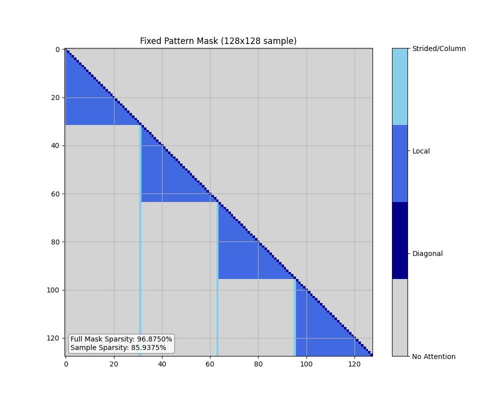

# Sparse Transformer Attention Masks for CIFAR-10

**한국어 버전은 [README_kr.md](README_kr.md)를 참고하세요.**

This project implements and visualizes sparse attention patterns for CIFAR-10 image data (32x32 pixels = 1024 tokens). Sparse attention patterns significantly reduce computational complexity and memory usage while maintaining the model's ability to capture local and global dependencies.

## Attention Patterns

Five types of attention patterns are implemented:

### 1. Normal (Full) Attention

The normal attention pattern implements standard causal attention:
- **Diagonal self-attention (value 1)**: Each token attends to itself
- **Lower triangular attention (value 2)**: Each token attends to all previous tokens

This pattern has **49.6% sparsity** (only upper triangular part is masked out).


### 2. Strided Pattern

The strided pattern combines three types of attention:
- **Diagonal self-attention (value 1)**: Each token attends to itself
- **Local window attention (value 2)**: Each token attends to nearby tokens within a local window
- **Strided attention (value 3)**: Each token attends to previous tokens at fixed intervals

This pattern achieves approximately **95.4% sparsity** with a window size and stride of 32.


### 3. Fixed Pattern

The fixed pattern uses:
- **Diagonal self-attention (value 1)**: Each token attends to itself
- **Block-wise local attention (value 2)**: Each token attends to previous tokens within the same block
- **Fixed column attention (value 3)**: Each token attends to the last token of each previous block

This pattern achieves approximately **96.9% sparsity** with a block size of 32.



### 4. Sliding Window Pattern

Each token attends to a fixed-size window of neighboring tokens (excluding itself):
- **Diagonal self-attention (value 1)**
- **Sliding window attention (value 2)**

This pattern achieves approximately **96.8% sparsity** with a window size of 32.


### 5. Dilated Sliding Window Pattern

Each token attends to a fixed number of positions spaced by a dilation factor:
- **Diagonal self-attention (value 1)**
- **Dilated sliding window attention (value 2)**

This pattern achieves approximately **96.8% sparsity** with a window size of 32 and dilation of 2.


## Implementation Details

This project is implemented as a single Python file that provides:

- Mask generation functions (step-by-step implementation)
- Mask visualization tools
- Sparsity calculation and statistics
- Side-by-side comparison of different attention patterns

## Usage

### Generating Attention Masks

```python
from sparse_transformer_mask import (
    create_normal_mask_step_by_step,
    create_strided_mask_step_by_step,
    create_fixed_mask_step_by_step,
    create_sliding_window_mask_step_by_step,
    create_dilated_sliding_window_mask_step_by_step
)

# Generate normal (full) attention mask
normal_mask = create_normal_mask_step_by_step(size=1024)

# Generate strided mask
strided_mask = create_strided_mask_step_by_step(size=1024, window_size=32, stride=32)

# Generate fixed mask
fixed_mask = create_fixed_mask_step_by_step(size=1024, window_size=32)

# Generate sliding window mask
sliding_window_mask = create_sliding_window_mask_step_by_step(size=1024, window_size=32)

# Generate dilated sliding window mask
dilated_sliding_window_mask = create_dilated_sliding_window_mask_step_by_step(size=1024, window_size=32, dilation=2)
```

#### Sparsity Information in case of 1024 tokens
```
Sparsity of each mask:
Normal Mask Sparsity: 49.9512%
Strided Mask Sparsity: 95.4086%
Fixed Mask Sparsity: 96.8750%
Sliding Window Mask Sparsity: 96.8033%
Dilated Sliding Window Mask Sparsity: 96.8292%
```


### Converting to Binary Masks

The generated masks have values 1, 2, and 3 to distinguish attention types, but for use in actual transformer models, they should be converted to binary masks (consisting only of 0s and 1s):

```python
import numpy as np
from sparse_transformer_mask import convert_to_binary_mask

# Convert to binary mask (all non-zero values to 1)
binary_strided_mask = convert_to_binary_mask(strided_mask)
binary_fixed_mask = convert_to_binary_mask(fixed_mask)

# Check binary mask sparsity
binary_sparsity = 1.0 - np.count_nonzero(binary_strided_mask) / binary_strided_mask.size
print(f"Binary mask sparsity: {binary_sparsity:.4%}")
```

### Visualizing Masks

```python
from sparse_transformer_mask import visualize_mask_sample
import matplotlib.pyplot as plt

# Mask visualization settings
custom_cmap = plt.cm.colors.ListedColormap(['lightgray', 'darkblue', 'royalblue', 'skyblue'])

# Visualize 64x64 sample
visualize_mask_sample(
    mask=strided_mask,
    title='Strided Pattern Mask',
    sample_size=64,
    colormap=custom_cmap,
    save_path='strided_mask_64x64.png'
)
```

### Comparing Multiple Attention Patterns

```python
from sparse_transformer_mask import visualize_mask_comparison

# Compare all five attention patterns side by side (showing 128x128 samples)
visualize_mask_comparison(
    masks=[
        normal_mask[:128, :128],
        strided_mask[:128, :128],
        fixed_mask[:128, :128],
        sliding_window_mask[:128, :128],
        dilated_sliding_window_mask[:128, :128]
    ],
    titles=[
        'Normal (Full) Attention',
        'Strided Pattern',
        'Fixed Pattern',
        'Sliding Window',
        'Dilated Sliding Window'
    ],
    sample_size=128,
    colormap=custom_cmap,
    save_path='mask_comparison_128x128.png'
)
```


### Running the Script Directly

```bash
python sparse_transformer_mask.py
```

This command:
1. Generates Normal, Strided, Fixed, Sliding Window, and Dilated Sliding Window pattern masks (all 1024x1024)
2. Visualizes samples of each mask type
3. Creates a side-by-side comparison of all five patterns (showing 128x128 samples from each)

## Color Mapping

The visualization uses a custom colormap to distinguish different attention types:
- **Gray (value 0)**: No attention (masked out)
- **Dark blue (value 1)**: Diagonal/self-attention
- **Royal blue (value 2)**: Local/sliding/dilated attention
- **Sky blue (value 3)**: Strided/fixed column attention

## Theoretical Efficiency

For a sequence length of 1024 (32x32 CIFAR-10 image):

- **Standard attention**: O(n²) = 1,048,576 operations
- **Sparse attention** (95% sparsity): O((1-s)·n²) = 52,428 operations
- **Theoretical speedup**: ~20x

## Requirements

- Python 3.6+
- NumPy
- Matplotlib

## References

- [Sparse Transformer (Child et al., 2019)](https://arxiv.org/abs/1904.10509)
- [Longformer (Beltagy et al., 2020)](https://arxiv.org/abs/2004.05150)
- [BigBird (Zaheer et al., 2020)](https://arxiv.org/abs/2007.14062) 