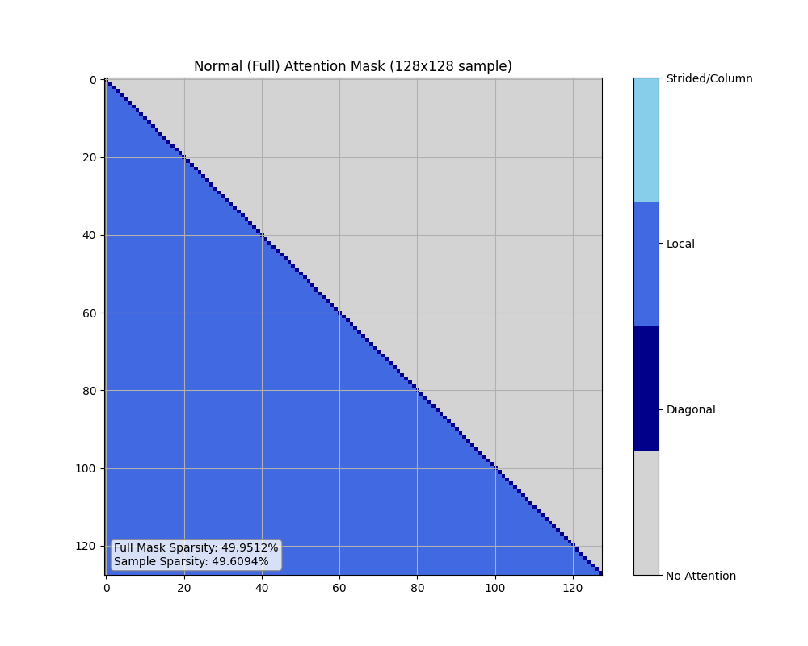
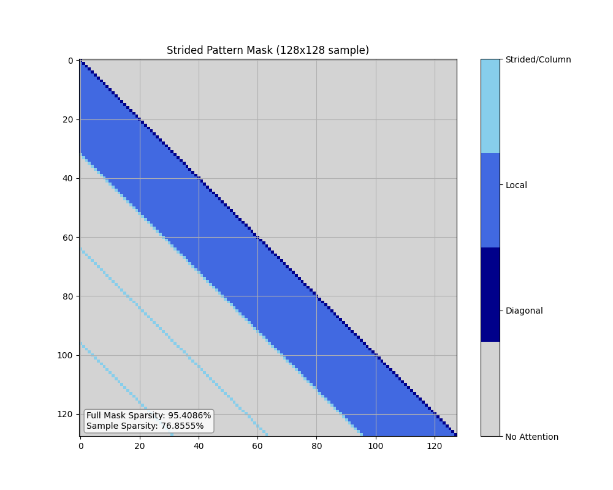
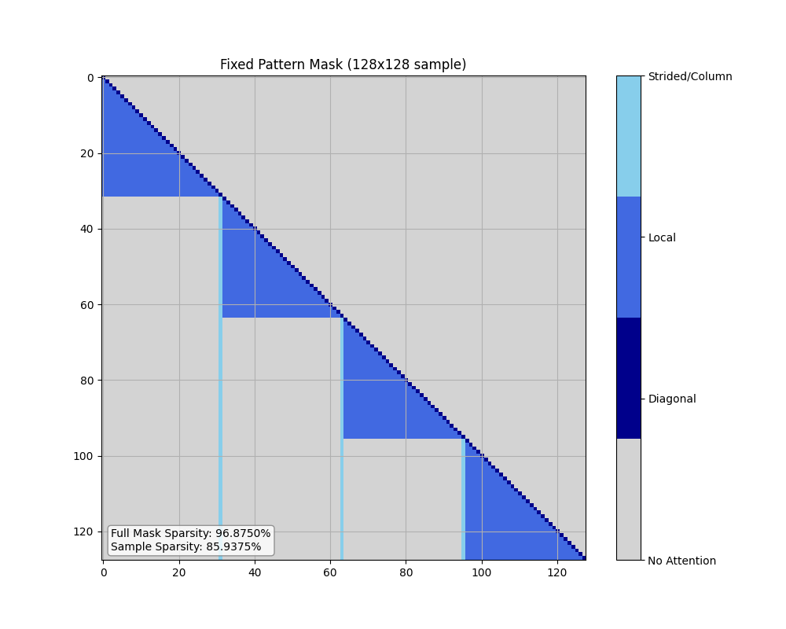
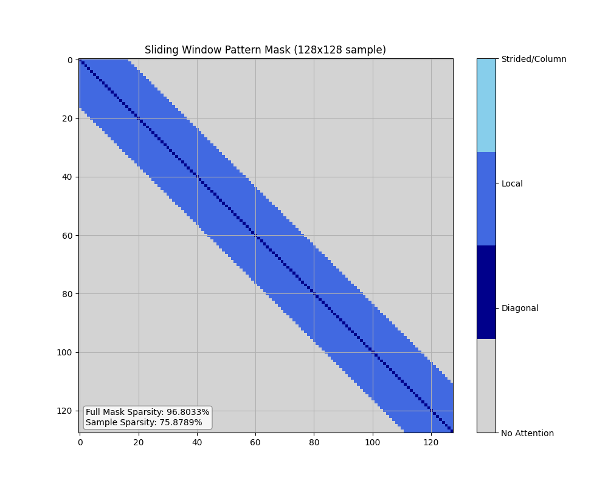
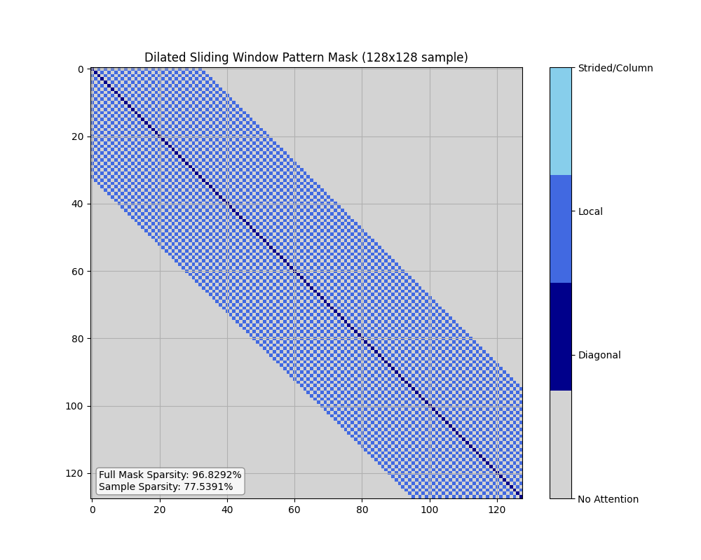
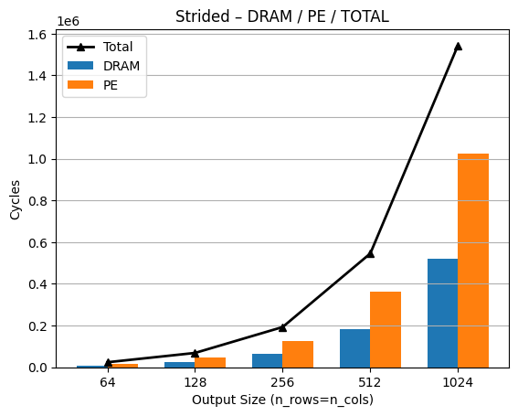
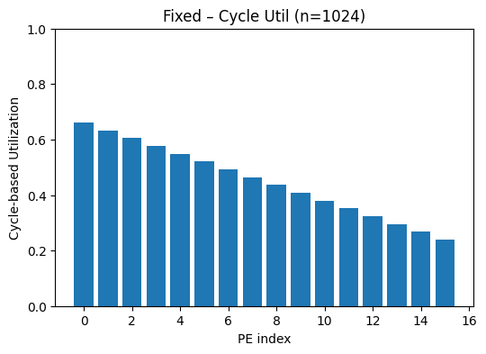
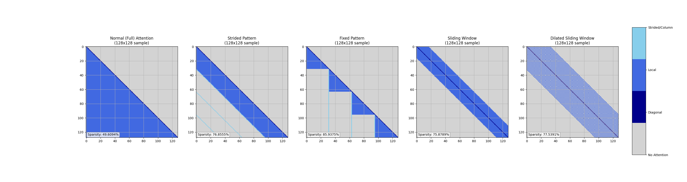

# Sparse Transformer Attention Masks

이 프로젝트는 트랜스포머 모델을 위한 희소 어텐션 패턴을 구현하고 시각화합니다. 희소 어텐션 패턴은 모델의 지역적 및 전역적 의존성 포착 능력을 유지하면서도 계산 복잡도와 메모리 사용량을 크게 줄입니다. CIFAR-10(32x32 RGB 이미지)을 예시로 사용하지만, 구현은 다양한 시퀀스 길이와 태스크에 적용할 수 있습니다.

## 스크립트 개요

이 프로젝트는 두 개의 주요 스크립트를 포함합니다:

1. `sparse_transformer_mask.py`: 다양한 attention 패턴을 구현하고 시각화
2. `mask_resource_calculator.py`: 마스크 연산의 리소스 요구사항 분석

### 1. Sparse Transformer Mask Generator

`sparse_transformer_mask.py` 스크립트는 다양한 attention 패턴을 생성하고 시각화하는 데 중점을 둡니다.

```bash
python sparse_transformer_mask.py --help
usage: sparse_transformer_mask.py [-h] [--size SIZE] [--window_size WINDOW_SIZE] [--stride STRIDE] 
                                 [--sample_size SAMPLE_SIZE] [--full_png] [--no_graphic] 
                                 [--order {row_first,column_first}] [--skip_pattern_print]

Sparse Transformer Attention Mask Implementation

options:
  -h, --help            show this help message and exit
  --size SIZE           Size of the square mask matrix (default: 1024)
  --window_size WINDOW_SIZE
                        Size of the local attention window (default: 32)
  --stride STRIDE       Stride between attention points (default: 32)
  --sample_size SAMPLE_SIZE
                        Size of the sample to visualize (default: 128)
  --full_png            Save full-size PNG images instead of samples
  --no_graphic          Bypass graphics and only print sparsity patterns
  --order {row_first,column_first}
                        Order of non-zero elements in the mask (default: row_first)
  --skip_pattern_print  Skip printing non-zero elements of the mask
```

### 2. Mask Resource Calculator

`mask_resource_calculator.py` 스크립트는 마스크 연산의 리소스 요구사항을 분석합니다:
- 필요한 고유한 행과 열의 수
- 연속된 연산 간의 리소스 요구사항 변화
- 최대 리소스 사용 케이스

```bash
python mask_resource_calculator.py --help
usage: mask_resource_calculator.py [-h] [--mask_size MASK_SIZE] [--num_multiplications NUM_MULTIPLICATIONS]
                                   [--window_size WINDOW_SIZE] [--stride STRIDE] [--read_limit READ_LIMIT]
                                   [--zigzag]

Calculate mask resources for sparse matrix multiplications.

options:
  -h, --help            show this help message and exit
  --mask_size MASK_SIZE
                        Size of the square mask matrix (default: 1024)
  --num_multiplications NUM_MULTIPLICATIONS
                        Total number of simultaneous multiplications (default: 64)
  --window_size WINDOW_SIZE
                        Size of the local attention window for strided/fixed masks (default: 32)
  --stride STRIDE       Stride for strided attention (default: 32)
  --read_limit READ_LIMIT
                        Limit the number of lines read from the file (default: 1000)
  --zigzag             Enable zigzag pattern for column sorting in odd rows (default: False)
```

스크립트는 `generated` 디렉토리에 각 마스크 타입별로 두 가지 파일을 생성합니다:
1. `{mask_type}_mask_{num_multiplications}_read_limit_{read_limit}[_zigzag].txt`: 계산 포인트 포함
2. `{mask_type}_mask_{num_multiplications}_read_limit_{read_limit}[_zigzag]_analysis.txt`: 분석 결과 포함

지그재그 패턴이 활성화된 경우 파일명에 `_zigzag` 접미사가 추가됩니다.

## Attention Patterns

다섯 가지 유형의 attention 패턴이 구현되어 있습니다:

### 1. Normal (Full) Attention

일반 attention 패턴은 표준 causal attention을 구현합니다:
- **대각선 self-attention (값 1)**: 각 토큰이 자신에게 주의
- **하부 삼각형 attention (값 2)**: 각 토큰이 이전의 모든 토큰에게 주의

이 패턴은 **49.6%의 희소성**을 가집니다 (상부 삼각형 부분만 마스킹됨).



### 2. Strided Pattern

strided 패턴은 세 가지 유형의 attention을 결합합니다:
- **대각선 self-attention (값 1)**: 각 토큰이 자신에게 주의
- **로컬 윈도우 attention (값 2)**: 각 토큰이 로컬 윈도우 내의 인접 토큰에게 주의
- **Strided attention (값 3)**: 각 토큰이 고정된 간격의 이전 토큰에게 주의

이 패턴은 윈도우 크기와 stride가 32일 때 약 **95.4%의 희소성**을 달성합니다.



### 3. Fixed Pattern

fixed 패턴은 다음을 사용합니다:
- **대각선 self-attention (값 1)**: 각 토큰이 자신에게 주의
- **블록 단위 로컬 attention (값 2)**: 각 토큰이 같은 블록 내의 이전 토큰에게 주의
- **고정 열 attention (값 3)**: 각 토큰이 각 이전 블록의 마지막 토큰에게 주의

이 패턴은 블록 크기가 32일 때 약 **96.9%의 희소성**을 달성합니다.



### 4. Sliding Window Pattern

각 토큰은 고정 크기의 인접 토큰 윈도우에 주의합니다 (자신 제외):
- **대각선 self-attention (값 1)**
- **Sliding window attention (값 2)**

이 패턴은 윈도우 크기가 32일 때 약 **96.8%의 희소성**을 달성합니다.



### 5. Dilated Sliding Window Pattern

각 토큰은 dilation factor로 간격을 둔 고정된 수의 위치에 주의합니다:
- **대각선 self-attention (값 1)**
- **Dilated sliding window attention (값 2)**

이 패턴은 윈도우 크기가 32이고 dilation이 2일 때 약 **96.8%의 희소성**을 달성합니다.



## 하드웨어 시뮬레이션 및 분석 (`spt/` 디렉토리)

`spt/` 디렉토리는 딥러닝에서 행렬 곱셈을 가속화하는 일반적인 하드웨어 아키텍처인 PE(Processing Element) 배열에서 희소 어텐션 패턴의 성능을 시뮬레이션하고 분석하기 위한 스크립트와 생성된 플롯을 포함합니다. 이 시뮬레이션은 다양한 데이터 흐름 전략(행 단위, 열 단위)을 평가하고 사이클 수 및 PE 활용도에 대한 통찰력을 제공합니다.

### 주요 시뮬레이션 스크립트:
- `spt_mask.py`: 시뮬레이션 환경 내에서 사용되는, 메인 `sparse_transformer_mask.py`와 유사한 마스크 생성 함수를 제공합니다.
- `spt_sim.py`: 희소 어텐션을 위한 기본 PE 배열 시뮬레이터입니다.
- `spt_row.py` & `spt_col.py`: 메모리(DRAM/SRAM) 및 DMA 모델링을 포함하여 보다 상세한 행 단위 및 열 단위 데이터 흐름 시뮬레이션을 구현합니다.
- `spt_sim4.py`: 다양한 구성(다른 마스크 유형, 크기, 임베딩 차원)을 실행하고 성능 분석 플롯을 생성하는 포괄적인 시뮬레이션 스크립트입니다.

### 성능 분석 플롯 (`spt/plots/`):
`spt/plots/` 하위 디렉토리에는 시뮬레이션 스크립트에 의해 생성된 수많은 시각화 자료가 포함되어 있으며, 하드웨어 성능 지표를 보여줍니다. 이 플롯은 다양한 행렬 크기(예: 16x16, 32x32, 64x64) 및 임베딩 차원(예: 16, 32, 64)에 대해 사용할 수 있습니다.

- **사이클 비교 플롯 (`cycle_comp_*.png`)**: 다양한 어텐션 패턴에 필요한 총 사이클을 보여줍니다.
- **PE 사이클 활용도 플롯 (`pe_cycle_util_*.png`)**: 계산의 다양한 단계에서 처리 요소가 얼마나 효율적으로 활용되는지 보여줍니다.
- **행 PE 활용도 플롯 (`row_pe_util_*.png`)**: 특히 행 단위 처리에서 PE 활용도에 대한 통찰력을 제공합니다.
- **총 사이클 막대 차트 (`*_total_cycle_bar_*.png`)**: 총 계산 및 DRAM 접근 사이클을 요약합니다.

#### 예시 플롯:


*예시: Strided 패턴에 대한 사이클 비교*


*예시: 1024 토큰을 사용한 Fixed 패턴의 PE 사이클 활용도*

## 구현 세부사항

이 프로젝트는 다음을 제공하는 단일 Python 파일로 구현되어 있습니다:

- 마스크 생성 함수 (단계별 구현)
- 마스크 시각화 도구
- 희소성 계산 및 통계
- 다양한 attention 패턴의 나란한 비교

## 사용법

### Attention 마스크 생성

```python
from sparse_transformer_mask import (
    create_normal_mask_step_by_step,
    create_strided_mask_step_by_step,
    create_fixed_mask_step_by_step,
    create_sliding_window_mask_step_by_step,
    create_dilated_sliding_window_mask_step_by_step
)

# 일반 (full) attention 마스크 생성
normal_mask = create_normal_mask_step_by_step(size=1024)

# strided 마스크 생성
strided_mask = create_strided_mask_step_by_step(size=1024, window_size=32, stride=32)

# fixed 마스크 생성
fixed_mask = create_fixed_mask_step_by_step(size=1024, window_size=32)

# sliding window 마스크 생성
sliding_window_mask = create_sliding_window_mask_step_by_step(size=1024, window_size=32)

# dilated sliding window 마스크 생성
dilated_sliding_window_mask = create_dilated_sliding_window_mask_step_by_step(size=1024, window_size=32, dilation=2)
```

#### 1024 토큰의 경우 희소성 정보
```
각 마스크의 희소성:
Normal Mask Sparsity: 49.9512%
Strided Mask Sparsity: 95.4086%
Fixed Mask Sparsity: 96.8750%
Sliding Window Mask Sparsity: 96.8033%
Dilated Sliding Window Mask Sparsity: 96.8292%
```

### Binary 마스크로 변환

생성된 마스크는 attention 유형을 구분하기 위해 값 1, 2, 3을 가지지만, 실제 transformer 모델에서 사용하기 위해서는 binary 마스크(0과 1로만 구성)로 변환해야 합니다:

```python
import numpy as np
from sparse_transformer_mask import convert_to_binary_mask

# binary 마스크로 변환 (모든 0이 아닌 값을 1로)
binary_strided_mask = convert_to_binary_mask(strided_mask)
binary_fixed_mask = convert_to_binary_mask(fixed_mask)

# binary 마스크 희소성 확인
binary_sparsity = 1.0 - np.count_nonzero(binary_strided_mask) / binary_strided_mask.size
print(f"Binary mask sparsity: {binary_sparsity:.4%}")
```

### 마스크 시각화

```python
from sparse_transformer_mask import visualize_mask_sample
import matplotlib.pyplot as plt

# 마스크 시각화 설정
custom_cmap = plt.cm.colors.ListedColormap(['lightgray', 'darkblue', 'royalblue', 'skyblue'])

# 64x64 샘플 시각화
visualize_mask_sample(
    mask=strided_mask,
    title='Strided Pattern Mask',
    sample_size=64,
    colormap=custom_cmap,
    save_path='strided_mask_64x64.png'
)
```

### 여러 Attention 패턴 비교

```python
from sparse_transformer_mask import visualize_mask_comparison

# 모든 다섯 가지 attention 패턴을 나란히 비교 (128x128 샘플 표시)
visualize_mask_comparison(
    masks=[
        normal_mask[:128, :128],
        strided_mask[:128, :128],
        fixed_mask[:128, :128],
        sliding_window_mask[:128, :128],
        dilated_sliding_window_mask[:128, :128]
    ],
    titles=[
        'Normal (Full) Attention',
        'Strided Pattern',
        'Fixed Pattern',
        'Sliding Window',
        'Dilated Sliding Window'
    ],
    sample_size=128,
    colormap=custom_cmap,
    save_path='mask_comparison_128x128.png'
)
```



### 스크립트 직접 실행

```bash
python mask_resource_calculator.py
```
또는 다음 옵션을 따르세요

```bash
% python mask_resource_calculator.py --help                           
usage: mask_resource_calculator.py [-h] [--mask_size MASK_SIZE] [--num_multiplications NUM_MULTIPLICATIONS]
                                   [--window_size WINDOW_SIZE] [--stride STRIDE] [--read_limit READ_LIMIT]
                                   [--zigzag]
```

## 라이선스

이 프로젝트는 MIT 라이선스 하에 배포됩니다 - 자세한 내용은 LICENSE 파일을 참조하세요.
